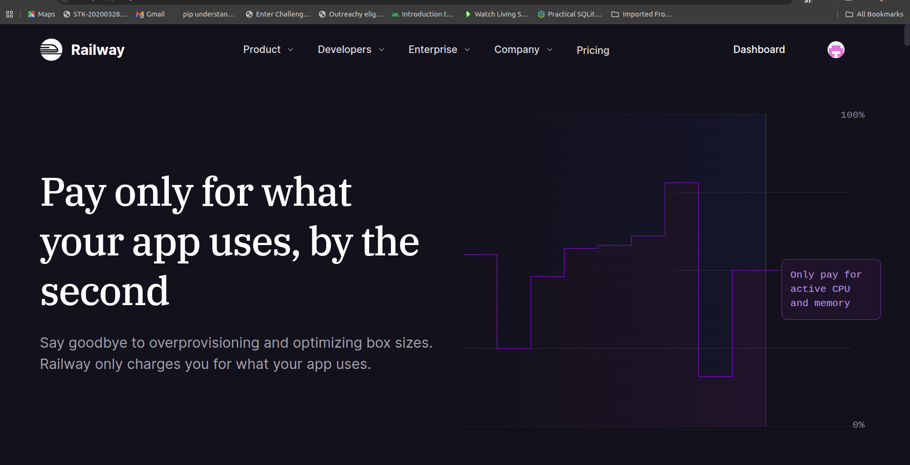

# Scalability Awareness — Task Manager on Railway

**Student:** Arinda Atweta Asiimwe
**Application:** Task Manager
**PaaS Provider:** Railway

---

## 1. Railway's Usage-Based Pricing and How Traffic Affects Cost

Railway uses a **usage-based pricing model**, meaning you pay only for the resources your application actually consumes. There are no fixed per-instance fees — costs scale directly with usage.



### Current Pricing Structure

| Resource       | Cost                     | What It Measures                          |
| -------------- | ------------------------ | ----------------------------------------- |
| **CPU**        | $0.000463 / vCPU / min   | Processing power used by the application  |
| **Memory**     | $0.000231 / GB / min     | RAM consumed by the application           |
| **Disk**       | $0.000257 / GB / min     | Storage used by the database volume       |
| **Network**    | $0.10 / GB (egress)      | Data sent out to users                    |

### Cost Estimates at Different Traffic Levels

| Traffic Level       | Monthly Requests | Estimated CPU  | Estimated RAM | Estimated Monthly Cost |
| ------------------- | ---------------- | -------------- | ------------- | ---------------------- |
| **Low** (current)   | ~1,000           | 0.1 vCPU avg   | 256 MB avg    | ~$2–3                  |
| **Medium**          | ~50,000          | 0.5 vCPU avg   | 512 MB avg    | ~$10–15                |
| **High**            | ~500,000         | 2 vCPU avg     | 1 GB avg      | ~$40–60                |
| **Very High**       | ~5,000,000       | 4+ vCPU avg    | 4 GB avg      | ~$150–250              |

### How Increased Traffic Affects the Application

1. **CPU Usage Increases:** Each incoming HTTP request requires CPU time for routing, JWT verification, database queries, and JSON serialization. More users means more concurrent requests and higher CPU consumption.

2. **Memory Usage Grows:** Each active database connection consumes memory. The connection pool is configured with a maximum of 10 connections (`max: 10` in `connection.js`). Under high traffic, more connections are active simultaneously, increasing RAM usage. Node.js also stores request/response buffers in memory.

3. **Database Load Increases:** Every task operation (list, create, update, delete) runs a SQL query. With more concurrent users, the PostgreSQL database handles more simultaneous queries, increasing its CPU and I/O usage. Database indexes on `user_id`, `status`, and `priority` help maintain query performance as data grows.

4. **Network Egress Costs Rise:** Each page load transfers HTML, CSS, and JavaScript to the user's browser. Each API response sends JSON data. More users means more data transferred out, increasing network egress costs.

5. **Billing Scales Proportionally:** Unlike fixed-price plans where you pay the same regardless of usage, Railway's model means costs rise gradually with traffic. There are no sudden price jumps, but costs can grow quickly if traffic spikes unexpectedly.

---

## 2. Scaling Plan

### Phase 1: Optimise the Current Single-Instance Setup (0–50,000 requests/month)

These improvements maximise performance without adding infrastructure:

| Action | Description | Impact |
| ------ | ----------- | ------ |
| **Increase connection pool** | Raise `max` from 10 to 20 in `connection.js` | Handles more concurrent DB queries |
| **Add response caching** | Cache the health check endpoint and static assets with `Cache-Control` headers | Reduces repeated computation and bandwidth |
| **Compress responses** | Add `compression` middleware to Express | Reduces network egress by 60–80% for text responses |
| **Optimise queries** | Use `SELECT` with specific columns instead of `SELECT *` | Reduces data transfer between app and database |

### Phase 2: Vertical Scaling (50,000–500,000 requests/month)

Railway allows increasing resources allocated to a single instance:

- **Increase CPU/RAM limits** in Railway Settings → Scale section. Railway can allocate up to 8 vCPU and 32 GB RAM per service.
- **Upgrade PostgreSQL** to a larger instance with more connections and faster I/O through Railway's database settings.
- **Add a dedicated volume** for database storage to improve disk I/O performance.

This is the simplest scaling step — no code changes required, just adjusting resource limits in the dashboard.

### Phase 3: Horizontal Scaling (500,000+ requests/month)

When a single instance cannot handle the load, horizontal scaling distributes traffic across multiple instances:

```
                    ┌──────────────────┐
                    │  Railway Load    │
                    │   Balancer       │
                    └───────┬──────────┘
                            │
              ┌─────────────┼─────────────┐
              ▼             ▼             ▼
        ┌──────────┐  ┌──────────┐  ┌──────────┐
        │ Instance │  │ Instance │  │ Instance │
        │    1     │  │    2     │  │    3     │
        └────┬─────┘  └────┬─────┘  └────┬─────┘
             │             │             │
             └─────────────┼─────────────┘
                           ▼
                   ┌───────────────┐
                   │  PostgreSQL   │
                   │  (shared DB)  │
                   └───────────────┘
```

**Steps to implement:**

1. **Set replica count** in Railway Settings → Scale → increase the number of replicas. Railway's load balancer automatically distributes incoming requests across instances.

2. **Ensure stateless design** — the application already stores no state in memory (sessions are JWT-based, data is in PostgreSQL), so it is ready for horizontal scaling without code changes.

3. **Increase database connection pool limits** — with 3 instances each having a pool of 10 connections, the database must handle 30 concurrent connections. This may require upgrading the PostgreSQL instance.

### Phase 4: Advanced Scaling (5,000,000+ requests/month)

For very high traffic, additional architectural changes would be needed:

| Strategy | Implementation | Benefit |
| -------- | -------------- | ------- |
| **Redis caching** | Add a Redis service on Railway to cache frequent queries (e.g., task lists) | Reduces database load by 50–70% |
| **CDN for static files** | Serve HTML/CSS/JS through a CDN like Cloudflare | Offloads static file requests from the app server |
| **Read replicas** | Add PostgreSQL read replicas for `SELECT` queries | Distributes database read load across multiple instances |
| **Rate limiting** | Add `express-rate-limit` middleware | Protects against abuse and ensures fair usage |
| **Queue-based processing** | Move heavy operations to a background worker via a message queue | Keeps API responses fast under load |

---

## Summary

The Task Manager application is well-positioned for scalability on Railway because:

- **Stateless architecture:** JWT-based auth and no in-memory sessions mean any instance can handle any request, enabling easy horizontal scaling.
- **Database indexes:** Indexes on `user_id`, `status`, and `priority` maintain fast query performance as data volume grows.
- **Connection pooling:** The `pg` pool reuses database connections efficiently rather than opening a new connection per request.
- **Usage-based pricing:** Railway's pay-for-what-you-use model means costs start low and grow proportionally with traffic — there are no wasted resources during low-traffic periods.

The scaling plan progresses from simple optimisations (caching, compression) to vertical scaling (more CPU/RAM) to horizontal scaling (multiple instances) and finally to architectural changes (Redis, CDN, read replicas) as traffic demands increase.

---

*End of Scalability Awareness Document*
